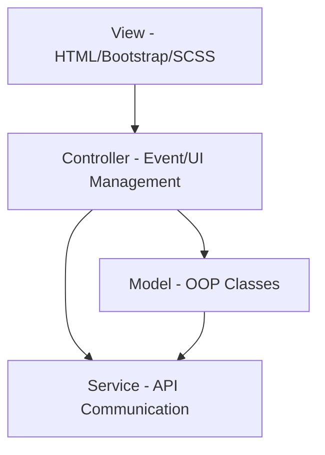
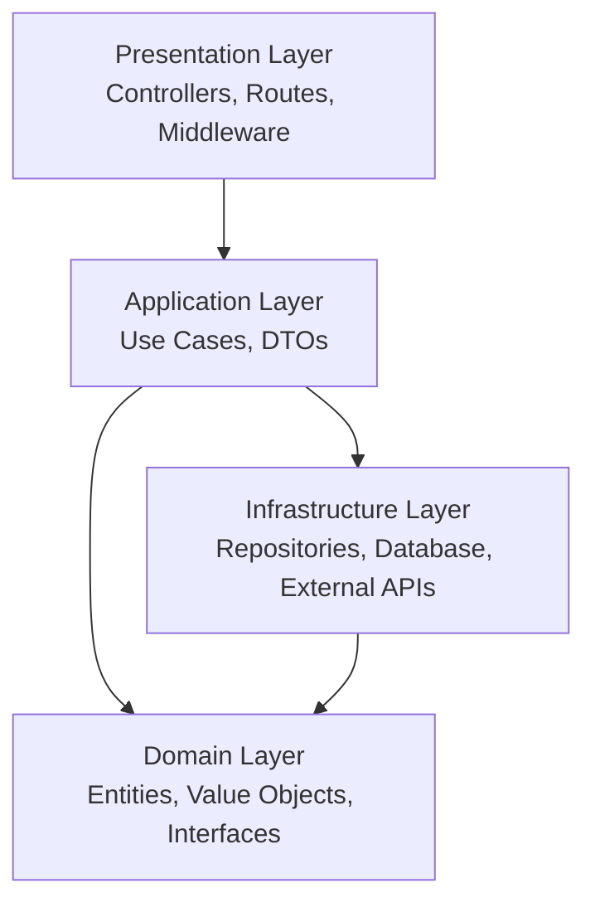

# 🧸 Project Blockify

> **E-commerce platform specialized in toys and puzzles**

---

## 📋 Table of Contents

- [Overview](#overview)
- [Tech Stack](#tech-stack)
- [Architecture](#architecture)
- [Folder Structure](#folder-structure)
- [Features](#features)
- [Development Guidelines](#development-guidelines)

---

## 🎯 Overview

**Project Blockify** is a modern e-commerce web application dedicated to toys and puzzles. Built with a clean separation of concerns using **MVC + OOP** on the frontend and **DDD + Clean Architecture** on the backend.

---

## 🚀 Tech Stack

### 🎨 Frontend
- **Languages & UI**: HTML, CSS, SCSS, Bootstrap, TypeScript
- **Architecture**: MVC + Object-Oriented Programming
- **HTTP Client**: Axios (primary), Fetch API (fallback)
- **Data Format**: JSON

### 🔧 Backend  
- **Runtime & Framework**: Node.js, TypeScript, Express.js
- **Architecture**: Domain-Driven Design (DDD) + Clean Architecture (Onion Architecture)
- **Database**: Supabase (PostgreSQL + SDK)
- **API Style**: REST API returning JSON

---

## 🏗️ Architecture

### Frontend Architecture (MVC + OOP)



- **Model**: OOP classes implementing the 4 core principles (Encapsulation, Abstraction, Inheritance, Polymorphism)
- **View**: HTML templates with Bootstrap styling and SCSS
- **Controller**: Module-based controllers handling events, calling services, and updating views

### Backend Architecture (DDD + Clean Architecture)



- **Presentation**: Entry points (controllers, routes, middleware)
- **Application**: Business use cases and Data Transfer Objects
- **Domain**: Core business logic and interfaces
- **Infrastructure**: External dependencies and implementations

---

## 📁 Folder Structure

### Frontend Structure
```
src/
├── 📁 core/
│   ├── 📁 models/           # OOP Models (User, Product, Article)
│   ├── 📁 services/         # API services (Axios client + endpoints)
│   └── 📁 utils/            # Helper functions
├── 📁 modules/              # Feature modules (MVC pattern)
│   ├── 📁 products/
│   │   ├── 📄 ProductController.ts
│   │   ├── 📄 product-view.html
│   │   └── 📄 product.css
│   └── 📁 auth/
│       ├── 📄 AuthController.ts
│       ├── 📄 auth-view.html
│       └── 📄 auth.css
├── 📁 shared/
│   └── 📁 components/       # Reusable UI components
└── 📄 app.ts               # Application initialization
```

### Backend Structure
```
src/
├── 📁 presentation/
│   ├── 📁 controllers/      # HTTP request handlers
│   ├── 📁 routes/          # API route definitions
│   └── 📁 middleware/      # Request/response middleware
├── 📁 application/
│   ├── 📁 services/        # Application services (use cases)
│   └── 📁 dto/             # Data Transfer Objects
├── 📁 domain/
│   ├── 📁 entities/        # Rich domain entities
│   ├── 📁 value-objects/   # Domain value objects
│   ├── 📁 repository-interfaces/ # Repository contracts
│   └── 📁 events/          # Domain events
└── 📁 infrastructure/
    ├── 📁 repositories/    # Supabase implementations
    ├── 📁 database/        # Database client configuration
    └── 📁 external/        # Third-party service adapters
```

---

## ✨ Features

### 🛍️ Frontend Features
- **Product Catalog**: Browse toys and puzzles by categories
- **Content Management**: Display articles and blog posts
- **Admin Panel**: CRUD operations for categories, products, and articles
- **Authentication**: User registration and login system
- **Responsive Design**: Mobile-first approach with Bootstrap
- **AJAX Integration**: Seamless data fetching without page reloads

### 🔧 Backend Features
- **RESTful API**: JSON-based API endpoints
- **Core Modules**: User management, product catalog, article system
- **Business Logic**: Use cases handled by application services
- **Data Persistence**: Repository pattern with Supabase integration
- **Domain-Rich Models**: Entities following OOP principles

---

## 📋 Development Guidelines

### 🎯 Frontend Guidelines
- ✅ Follow **MVC + OOP** architecture strictly
- ✅ Implement all **4 OOP principles** in model classes:
  - **Encapsulation**: Private properties with public methods
  - **Abstraction**: Abstract base classes and interfaces
  - **Inheritance**: Extend base classes for specialized behavior
  - **Polymorphism**: Override methods for different implementations
- ✅ Use **Axios** as primary HTTP client
- ✅ All data exchange in **JSON format**
- ✅ Component-based UI with reusable elements

### 🏛️ Backend Guidelines
- ✅ Maintain **pure DDD + Clean Architecture** (no MVC mixing)
- ✅ Business logic stays in **Domain Layer**
- ✅ Use cases implemented as **Application Services**
- ✅ Repository pattern for **data access abstraction**
- ✅ **JSON-only** API responses
- ✅ Rich domain entities with proper business rules

### 🔄 Communication Guidelines
- ✅ **AJAX/Webservice**: Use existing services, don't create new ones
- ✅ **JSON Format**: All client-server communication
- ✅ **REST Conventions**: Proper HTTP methods and status codes
- ✅ **Error Handling**: Consistent error response format

---

## 🎮 Getting Started

1. **Clone the repository**
2. **Install dependencies** for both frontend and backend
3. **Configure Supabase** connection
4. **Run development servers**
5. **Start building amazing toy experiences!** 🚀

---

*! Let's build something amazing together! 🧩✨*
